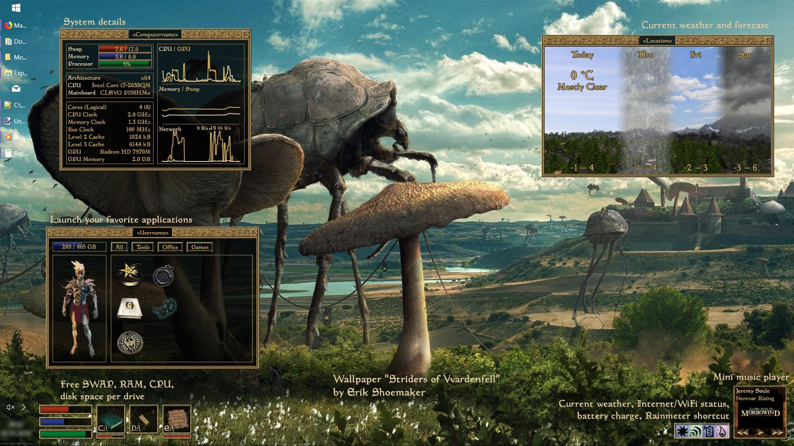

# morrowrain

[Rainmeter skins](https://www.rainmeter.net/) adding Morrowind UI elements ([Forum discussion](https://forum.rainmeter.net/viewtopic.php?f=27&t=30583)).

# Skins

## Status bars

Show free SWAP, RAM, and CPU. 

Click to open attribute window.

## Attribute window

Shows various system information. 

Click top-right corner to close.

## Item boxes

Show free disk space per drive.

If more than five drives are needed, edit the .ini to add additional meters. 
They will be detected automatically by the update script.

Click to open the inventory window

## Inventory window

Launch applications.

Edit the .ini to add or change buttons and icons. 
Icons are filtered by their group and can be in multiple groups. 
If you have too many icons, replace the "All" button with a "Favorites" button (and create a respective group) or remove it entirely.

A few thematic icons are provided. If you create additional icons, please consider sharing them in the forum or in a Github issue.

Click top-right corner to close.

## Enchantment bar

* Current weather, color represents temperature. Click to open the weather window.
* Internet/WiFi status
* Battery status
* Rainmeter quick launch

## Mini player

Edit the .ini to configure your player ([see docs](https://docs.rainmeter.net/manual/measures/nowplaying/#playerlist)).

If the player is detected, the Morrowind mini map is replaced with album art. Move the mouse to show track details and controls.

## Weather window

Shows current weather and forecast.

Click top-right corner to close.

## Other

* Wallpaper: ["Striders of Vvardenfell"](https://www.deviantart.com/erikshoemaker/art/Striders-of-Vvardenfell-577075876).
* Task bar hidden by [Adaptive Translucent Taskbar](https://forum.rainmeter.net/viewtopic.php?f=27&t=29314)

# Details

## Configure weather provider

By default, Yahoo weather with automatic location detection is used. To manually configure the location, edit `@Resources\Includes\weather_toay_yahoo.inc`. Yahoo parsing code by [khanhas Weatherbox](https://forum.rainmeter.net/viewtopic.php?f=27&t=24597).

To use a different weather provider, edit `enchantments*.ini` and `weather.ini`; in the `MEASURES` part, replace the Yahoo-weather include with a weather provider of your choice.
If you create includes for a different weather provider, please consider sharing them in the forum or in a Github issue.

The weather includes must provide the following measures

### Today's weather (for enchantments bar)

* **MeasureTempCelsius**: current temperature in °C
* **MeasureWeatherKey**: one of
  * Clear
  * Mostly Clear
  * Partly Cloudy
  * Mostly Cloudy
  * Cloudy
  * Rain
  * Rain and Snow
  * Snow
  * Thunder showers
  * Thunder
  * Windy
  * Haze
  * unknown

### Weather forecast (for weather window)
* **MeasureLocation**: location name
* **MeasureDayName1**: name or date of tomorrow
* **MeasureDayName2**: name or date of day after tomorrow
* **MeasureDayName3**: name or date of day three
* **UnitCode**: unit of all temperature mesures (eg. `°F` or `°C`)
* **MeasureTemp**: current temperature
* **MeasureWeatherKey** as in today's weather
* **MeasureWeatherDescription**: plain-text description of the current weather
* **MeasureTempDay**: Highest temperature of today
* **MeasureTempNight**: Lowest temperature of today
* **MeasureTempDay1**: Highest temperature of tomorrow
* **MeasureTempNight1**: Lowest temperature of tomorrow
* **MeasureTempDay2**: Highest temperature of the day after tomorrow
* **MeasureTempNight2**: Lowest temperature of the day after tomorrow
* **MeasureTempDay3**: Highest temperature of day 3
* **MeasureTempNight3**: Lowest temperature of day 3
